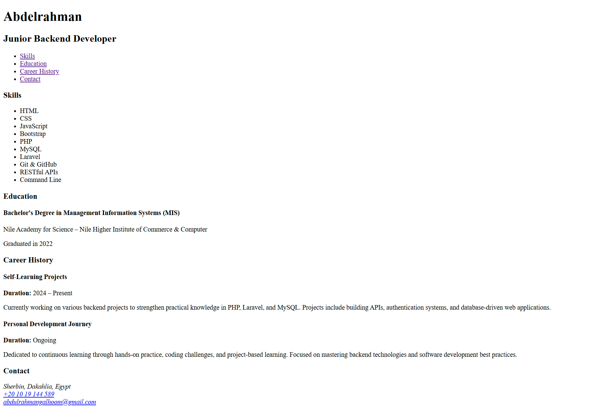

# Abdelrahman's Single-Page CV 📄

A simple, clean, single-page portfolio CV created to showcase my skills, educational background, and career history as a Junior Backend Developer.

## 🚀 Project Preview

Below is a snapshot of the live project:

## 💻 Technology Used

This project is a static page built purely with a single technology:

* **HTML5:** Used for the entire structure and content of the page.

*Note: The CV page itself lists many of my other professional skills (like PHP, Laravel, and MySQL), but they were not used to build this particular static page.*

## ✨ Inspiration

This project was inspired by the single-page CV project idea from [roadmap.sh](https://roadmap.sh/projects/single-page-cv). A huge thank you to them for providing excellent project ideas for developers.
